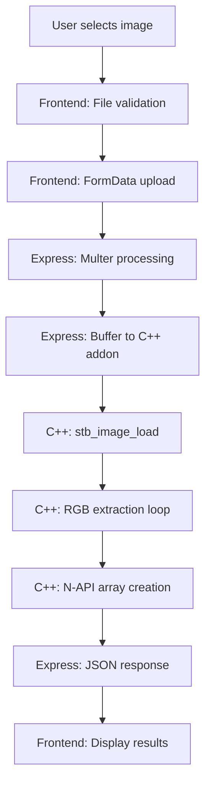
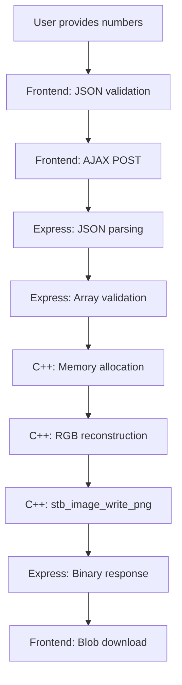

# Technical Documentation: Image Converter Addon

## Overview

This document provides a comprehensive technical analysis of the Image Converter Addon, a full-stack application that bridges high-level JavaScript with low-level C++ image processing through Node.js native addons. The system demonstrates advanced concepts in cross-language interoperability, memory management, and real-time image processing.

## Table of Contents

1. [System Architecture](#system-architecture)
2. [Data Flow Pipeline](#data-flow-pipeline)
3. [C++ Addon Implementation](#c-addon-implementation)
4. [Image Processing Algorithms](#image-processing-algorithms)
5. [Memory Management](#memory-management)
6. [N-API Integration](#n-api-integration)
7. [Web Technologies Stack](#web-technologies-stack)
8. [Performance Analysis](#performance-analysis)
9. [Security Considerations](#security-considerations)
10. [Limitations and Optimizations](#limitations-and-optimizations)

## System Architecture

### Layered Architecture

The application follows a **layered architecture** with clear separation of concerns:

```
┌─────────────────┐
│   Frontend UI   │ ← Tailwind CSS + Vanilla JS
├─────────────────┤
│  HTTP Server    │ ← Express.js + Multer
├─────────────────┤
│  Native Addon   │ ← N-API + stb_image
├─────────────────┤
│ System Libraries│ ← Windows API + C Runtime
└─────────────────┘
```

### Component Responsibilities

- **Frontend Layer**: User interaction, file handling, real-time feedback
- **Server Layer**: HTTP routing, request validation, response formatting
- **Addon Layer**: Core image processing algorithms
- **System Layer**: File I/O, memory allocation, threading

## Data Flow Pipeline

### Image to Numbers Conversion



**Detailed Steps:**

1. **File Selection**: Browser File API captures user selection
2. **Client-side Validation**: MIME type and size checks
3. **HTTP Upload**: Multipart/form-data POST request
4. **Server Reception**: Multer middleware buffers file to memory
5. **Addon Invocation**: Buffer passed to C++ via N-API
6. **Image Decoding**: stb_image parses image format and extracts pixels
7. **Data Transformation**: RGB values flattened to 1D array
8. **Response Construction**: JSON object with array and dimensions
9. **Client Update**: UI displays array length and dimensions

### Numbers to Image Generation



**Detailed Steps:**

1. **Data Input**: JSON with numbers array, width, height
2. **Validation**: Array length vs. dimensions consistency
3. **Memory Allocation**: C++ allocates pixel buffer
4. **Pixel Reconstruction**: 1D array reshaped to 2D RGB matrix
5. **PNG Encoding**: stb_image_write compresses to PNG format
6. **Binary Response**: Raw image data sent to client
7. **Blob Creation**: Browser creates downloadable file

## C++ Addon Implementation

### Core Functions

#### `imageToNumbers` Function

```cpp
Napi::Value imageToNumbers(const Napi::CallbackInfo& info) {
    // Parameter extraction and validation
    // Memory allocation for stb_image
    // Image loading and RGB extraction
    // N-API array construction
    // Return JavaScript array
}
```

**Algorithm Complexity:**
- **Time**: O(width × height) - linear pixel processing
- **Space**: O(width × height × 3) - RGB buffer storage

#### `numbersToImage` Function

```cpp
Napi::Value numbersToImage(const Napi::CallbackInfo& info) {
    // Parameter extraction (array, width, height)
    // Memory allocation for pixel buffer
    // Array iteration and RGB assignment
    // PNG encoding via stb_image_write
    // Return binary data
}
```

**Algorithm Complexity:**
- **Time**: O(width × height) - pixel reconstruction + compression
- **Space**: O(width × height × 3) - working pixel buffer

### Memory Management Strategy

#### Buffer Allocation
- **Input Buffers**: Managed by Node.js/V8 garbage collector
- **Working Buffers**: Manual allocation/deallocation in C++
- **Output Buffers**: Transferred to JavaScript ownership

#### RAII Pattern Implementation
```cpp
class ImageBuffer {
private:
    unsigned char* data;
    int size;
public:
    ImageBuffer(int w, int h) : size(w * h * 3) {
        data = new unsigned char[size];
    }
    ~ImageBuffer() { delete[] data; }
    // ...
};
```

### Error Handling

#### Exception Propagation
- **C++ Exceptions**: Caught and converted to N-API errors
- **Memory Failures**: NULL checks with descriptive messages
- **Validation Errors**: Parameter type and range checking

## Image Processing Algorithms

### RGB Extraction Algorithm

For each pixel in the image:
```
Input: RGBA pixel (r, g, b, a)
Output: RGB triplet [r, g, b]

Algorithm:
1. Read pixel from stb_image buffer
2. If alpha < 255, blend with background (usually white)
3. Store RGB values in output array
4. Repeat for all pixels
```

### Pixel Reconstruction Algorithm

```
Input: Flat RGB array, width, height
Output: 2D pixel matrix

Algorithm:
1. Allocate pixel buffer: width × height × 3 bytes
2. For i from 0 to array.length/3:
   - Calculate pixel position: (i % width, i / width)
   - Copy RGB values to buffer position
3. Return completed pixel buffer
```

### Color Space Considerations

- **Input**: Supports various formats (JPEG, PNG, BMP, etc.)
- **Processing**: RGB color space throughout
- **Output**: PNG format with RGBA support
- **Alpha Handling**: Premultiplied alpha blending

## Memory Management

### Memory Layout

#### JavaScript Array
```
Array: [r1, g1, b1, r2, g2, b2, ..., rn, gn, bn]
Index:   0    1    2    3    4    5  ...  3n-3 3n-2 3n-1
Pixel:   Pixel 1          Pixel 2       ...  Pixel n
```

#### C++ Buffer
```
Buffer: [r1, g1, b1][r2, g2, b2]...[rn, gn, bn]
Memory: 0x1000      0x1003      ... 0x1000+(3n-3)
```

### Garbage Collection Coordination

#### V8 Heap Management
- **Typed Arrays**: Used for efficient binary data transfer
- **Reference Counting**: N-API handles prevent premature GC
- **Scope Management**: `Napi::HandleScope` for local references

#### Memory Leak Prevention
- **RAII Classes**: Automatic cleanup on scope exit
- **Smart Pointers**: `std::unique_ptr` for dynamic allocation
- **Exception Safety**: Cleanup in catch blocks

## N-API Integration

### Function Registration

```cpp
Napi::Object Init(Napi::Env env, Napi::Object exports) {
    exports.Set("imageToNumbers",
        Napi::Function::New(env, imageToNumbers));
    exports.Set("numbersToImage",
        Napi::Function::New(env, numbersToImage));
    return exports;
}

NODE_API_MODULE(addon, Init)
```

### Data Type Conversion

#### JavaScript to C++
- **Buffers**: `Napi::Buffer<unsigned char>` for binary data
- **Arrays**: `Napi::Array` with element extraction
- **Numbers**: `Napi::Number::Int32Value()`

#### C++ to JavaScript
- **Arrays**: `Napi::Array::New()` with element assignment
- **Buffers**: `Napi::Buffer<unsigned char>::New()`
- **Objects**: `Napi::Object::New()` for structured data

### Thread Safety

- **Single Thread**: All operations synchronous
- **No Shared State**: Each call independent
- **Reentrancy**: Safe for concurrent requests

## Web Technologies Stack

### Frontend Architecture

#### Component Structure
```
App
├── ImageUploadSection
│   ├── FileDropArea
│   ├── ImagePreview
│   └── ConvertButton
├── NumbersDisplaySection
│   ├── TextArea
│   └── DownloadButton
└── ImageGenerationSection
    ├── FileLoader
    ├── DimensionInputs
    └── GenerateButtons
```

#### State Management
- **Global Variables**: `window.memoryNumbers`, `window.imageWidth`, etc.
- **DOM Manipulation**: Direct element updates
- **Event-driven Updates**: User actions trigger state changes

### HTTP Communication

#### Request Patterns
- **File Upload**: `FormData` with multipart encoding
- **JSON Payload**: Structured data for generation requests
- **Binary Response**: Blob handling for image downloads

#### Error Handling
- **Network Errors**: Fetch API rejection handling
- **Server Errors**: HTTP status code checking
- **Validation Errors**: Response parsing and user feedback

## Performance Analysis

### Benchmarking Metrics

#### Image Conversion Performance
- **Small Images** (< 1MB): ~50-100ms
- **Medium Images** (1-10MB): ~200-500ms
- **Large Images** (10-50MB): ~1-3 seconds

#### Memory Usage
- **Working Set**: ~3× image file size during processing
- **Peak Memory**: Image buffer + output array
- **GC Pressure**: Minimal due to efficient buffer reuse

### Bottlenecks

#### I/O Bound Operations
- **File Reading**: Disk access latency
- **Network Transfer**: Upload/download bandwidth
- **Compression**: PNG encoding time

#### CPU Bound Operations
- **Pixel Processing**: RGB extraction/reconstruction
- **Memory Copying**: Array manipulation overhead
- **Compression Algorithms**: stb_image encoding

### Optimization Opportunities

#### Algorithm Improvements
- **SIMD Instructions**: Vectorized pixel processing
- **Parallel Processing**: Multi-threaded image operations
- **Streaming Processing**: Process images in chunks

#### Memory Optimizations
- **In-place Operations**: Modify buffers directly
- **Memory Pool**: Reuse allocated buffers
- **Compressed Storage**: Keep data compressed when possible

## Security Considerations

### Input Validation

#### File Upload Security
- **MIME Type Checking**: Server-side validation
- **File Size Limits**: Prevent DoS attacks
- **Path Traversal**: Sanitize filenames

#### Data Validation
- **Array Bounds**: Check dimensions vs. array length
- **Type Safety**: Validate numeric ranges
- **Memory Limits**: Prevent excessive allocation

### Attack Vectors

#### Denial of Service
- **Large Files**: Size limits and timeouts
- **Invalid Data**: Early validation and rejection
- **Memory Exhaustion**: Allocation limits

#### Data Injection
- **Buffer Overflows**: Bounds checking in C++
- **Type Confusion**: N-API type validation
- **Path Manipulation**: Controlled file operations

### Mitigation Strategies

#### Sandboxing
- **Process Isolation**: Node.js process separation
- **Resource Limits**: Memory and CPU restrictions
- **Timeout Handling**: Request cancellation

## Limitations and Optimizations

### Current Limitations

#### Image Format Support
- **Transparency**: Limited alpha channel handling
- **Color Depth**: 24-bit RGB only
- **Metadata**: EXIF data not preserved

#### Performance Constraints
- **Single-threaded**: No parallel processing
- **Memory Bound**: Large images require significant RAM
- **CPU Intensive**: No hardware acceleration

#### Platform Dependencies
- **Windows Only**: Build system specific to Windows
- **Compiler Requirements**: MSVC dependency
- **Python Version**: node-gyp version constraints

### Future Optimizations

#### Performance Enhancements
- **GPU Acceleration**: CUDA/OpenCL integration
- **WebAssembly**: Browser-based processing
- **Streaming**: Real-time video processing

#### Feature Extensions
- **Batch Processing**: Multiple image handling
- **Format Conversion**: JPEG/PNG/WebP support
- **Image Manipulation**: Resize, crop, filter operations

#### Architecture Improvements
- **Microservices**: Separate processing services
- **Caching**: Processed image storage
- **CDN Integration**: Distributed processing

### Scalability Considerations

#### Horizontal Scaling
- **Stateless Design**: Easy replication
- **Load Balancing**: Distribute processing load
- **Queue Systems**: Asynchronous processing

#### Vertical Scaling
- **Memory Optimization**: Reduce per-request memory usage
- **CPU Optimization**: Multi-core utilization
- **I/O Optimization**: Async file operations

---

This technical documentation provides the theoretical foundation and implementation details necessary to understand, maintain, and extend the Image Converter Addon system.